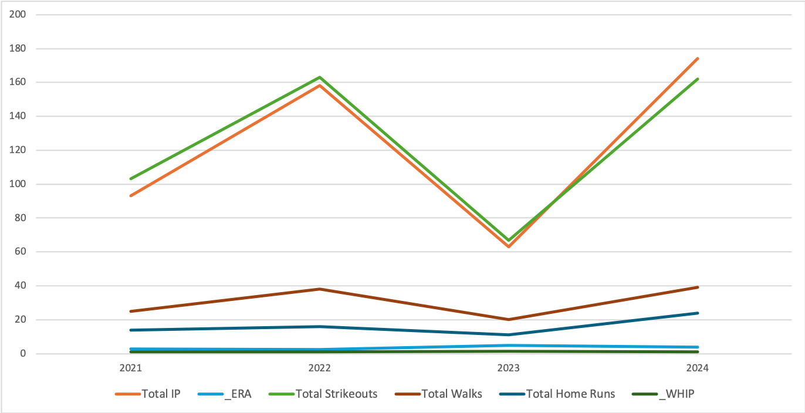
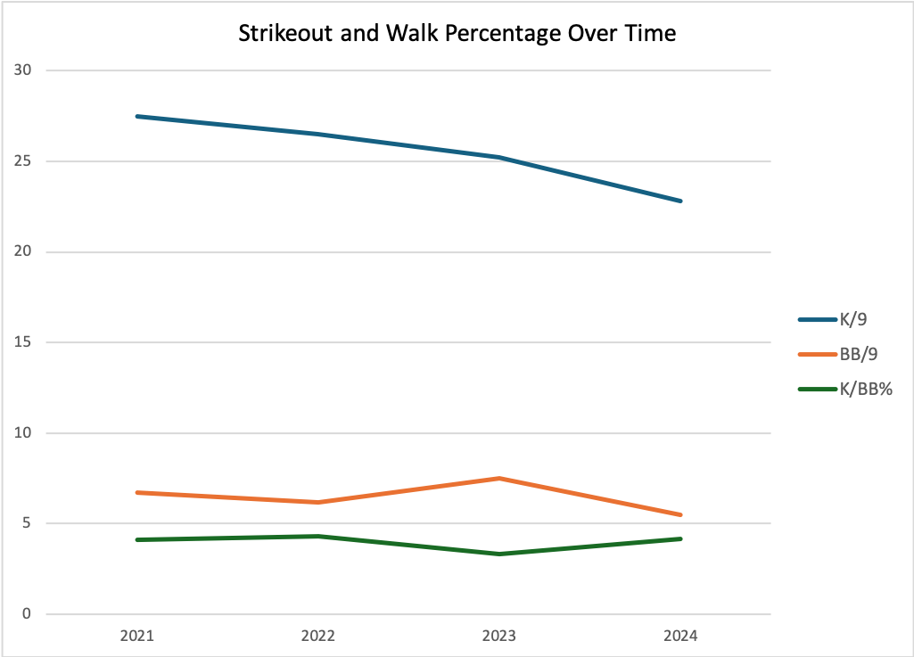
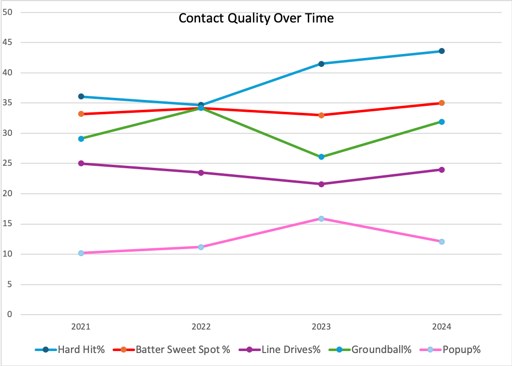

# Pitcher Analysis: Nestor Cortes Jr
## Summary
This project analyzes Nestor Cortes’ pitching performance from 2021–2024 using data sourced from Baseball Savant. The workflow includes:
* SQL for data extraction and preparation.
* Excel PivotTables and charts for visualization and trend analysis.
* Focus on changes in pitch characteristics (velocity, spin, movement), swing-and-miss rates, and batted-ball quality to explain his performance from 2021-2024.

I analyzed various metrics to better understand what made Nestor Cortes successful in 2021 and 2022 (where he was named an All Star) and what led to his decline in 2023 and 2024. Nestor Cortes built his success on deception — mixing arm slots, arm angles, and unique windups to keep hitters off balance despite lacking elite velocity. Even though Nestor Cortes maintained a similar strikeout percentage from 2021–2024, his walk rate spiked in 2023, which coincided with an increase in WHIP. To better understand why hitters were having more success, I analyzed his pitch mix and contact quality metrics. In 2023, hitters posted a higher hard-hit percentage, barrel rate, and in-zone contact compared to his peak seasons, showing they were squaring up pitches more often. Despite his ability to still generate whiffs, the decline in pitch movement — particularly on his fastball, slider, and sinker — made his arsenal more hittable. As a result, hitters adjusted and produced more damaging contact, driving the decline in effectiveness seen in 2023 and 2024.

## Findings
### Overall Trends
* From 2021-2022, Nestor Cortes was highly effective, earning an All Star selction (2022) with consitent strikeout rates (26.5-27.5 K/9) and solid command (BB/9 about 6.2-6.7).
* In 2023, his walk rate spiked to 7.5 BB/9 and his WHIP increased (from 0.9235 in 2022 to 1.2520 in 2023), which shows a decline in command and efficiency.
* In 2024, Cortes improved his control (5.5 BB/9) but had a drop in strikeout rate (22.8 K/9), which shows that hitters were making more productive contact.

### Swing & Miss vs. Contact
* Even though Cortes' whiff percentage (23.6-24.5%) and swing percentage (48.3-50.5%) remained consitent throughout the four seasons, he allowed more contact in dangerous areas.
* Cortes' hard hit percentage increased from 34.7% in 2022 to 41.5% in 2023 and 43.6% in 2024. This coincides with an increase in barrel percentage and batting average against.
* His out of zone swing and miss percentage remained consistent (34.9-36.1%) which means he was still able to get batters to chase and expand the zone, but they were not fooled by pitches in the zone.

### Pitch Mix
* 4-Seam Fastball
  * Increase in velocity: 90.7 MPH in 2021 to 92.1 MPH in 2024
  * Horiztonal break decreased from 5.6 inches in 2021 to 4.1 inches in 2023.
* Slider
  * Horizontal break decreased from -6.7 inches in 2021 to -2.4 inches in 2024, which means there was a decrease in glove side movement reducing its ability to deceive hitters.
* Cutter
  *Increase in velocity: 85.4 MPH in 2021 to 87.5 MPH in 2024
  * Vertical break decreased from -30.8 inches in 2021 to -26.9 inches in 2024.

## Conclusion
* Nestor Cortes' success in 2021-2022 came from limiting walks, deception, and keeping hitters off balance.
* His decline in 2023-2024 resulted from:
  * Loss of fastball and slider movement.
  * Control issues which resulted in more walks.
  * Increase in quality of contact so hitters were not fooled by pitches in the zone which resulted in my balls in play.
* While Cortes' velocity and spin rates either increased or remained consistent, the combination of reduced movement and command issues allowed hitters to adjust and make better contact. 
